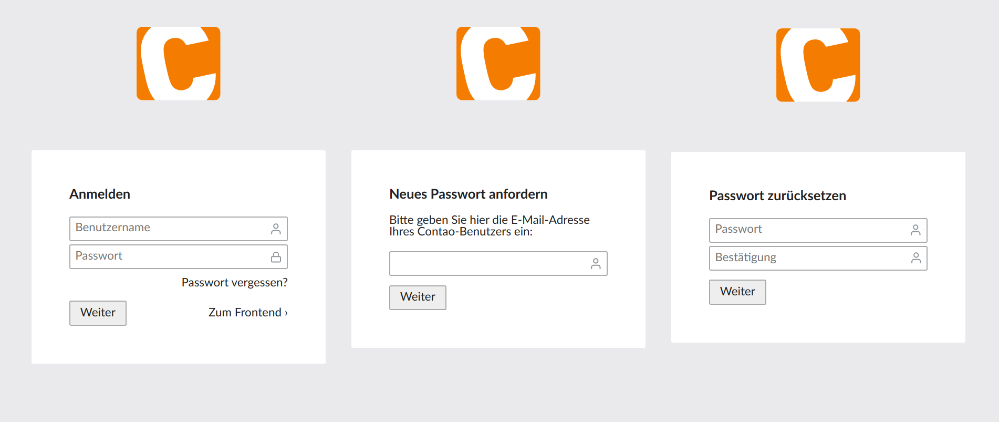

# Contao Backend Lost Password Bundle

This bundle offers a lost password function for the backend of the Contao CMS.



## Features

- don't ever send your customers new passwords if they forgot or lost theirs again :-)
- after a password request, an email is being sent to the email address of the corresponding user offering a reset link

## Installation

1. Install via composer: `composer require heimrichhannot/contao-backend-lost-password-bundle` and update your database.
1. Set the `huh_backend_lost_password.add_to_template` to true if you want the lost password link automatically added to you backend login template.

```yaml
huh_backend_lost_password:
    add_to_template: true
```

## Customize

### Usage in a custom template

You can insert the lost password link in a custom login template where you want by calling `BackendLostPasswortManager->getLostPasswordLink()`.

```
<!-- ... -->
<div class="widget">
    <label for="password"><?= $this->password ?></label>
    <input type="password" name="password" id="password" class="tl_text" value="" placeholder="<?= $this->password ?>" required>
</div>

<?= System::getContainer()->get(\HeimrichHannot\BackendLostPasswordBundle\Manager\BackendLostPasswordManager::class)->getLostPasswordLink() ?>

<div class="submit_container cf">
    <button type="submit" name="login" id="login" class="tl_submit"><?= $this->loginButton ?></button>
    <a href="<?= $this->route('contao_root') ?>" class="footer_preview"><?= $this->feLink ?> ›</a>
</div>
<!-- ... -->
```

### Adjust the email's text

Simply override the following `$GLOBALS` entries:

```
$GLOBALS['TL_LANG']['MSC']['backendLostPassword']['messageSubjectResetPassword']
$GLOBALS['TL_LANG']['MSC']['backendLostPassword']['messageBodyResetPassword']
```

## Configuration reference

```yaml
# Default configuration for extension with alias: "huh_backend_lost_password"
huh_backend_lost_password:

    # If true, that backend lost password link will be automatically added to the backed login template. Default false. Will be true in the next major version!
    add_to_template:      false
```