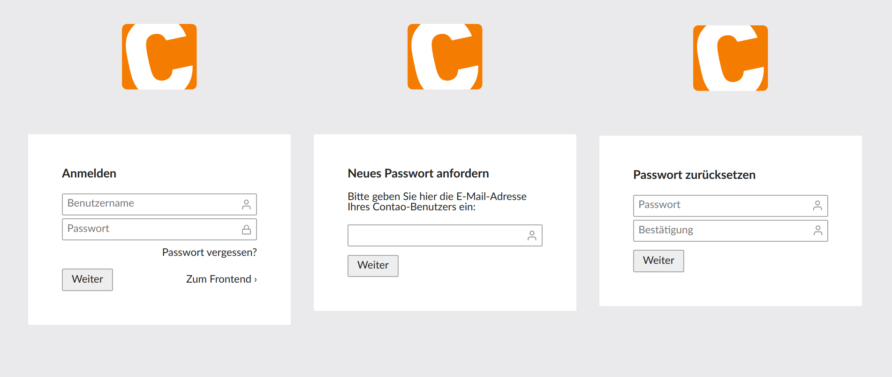

# Contao Backend Lost Password Bundle

This bundle offers a lost password function for the backend of the Contao CMS.



## Features

- Never send new passwords to your customers again if they have forgotten their old ones. :-)
- After requesting a new password, a password reset link is sent to the user's email.
- Optional Notification Center support

## Requirements
- Contao 5.3 or higher
- PHP 8.3 or higher

## Installation and Setup

1. Install the extension via the Contao Manager or Composer:

    ```shell
    composer require heimrichhannot/contao-backend-lost-password-bundle
    ```
   
2. Update your database.
3. Optional: Install Notification Center if you want to use it to send the password reset email.
4. Optional: To use a custom mailer transport with the built-in mailer, select it in the settings.
5. Optional: To use Notification Center, create a notification of type `User: Lost password` and select it in the settings. See details below.

## Customize

### Password reset email

You have two options for sending the password reset email: you can either use the built-in mail function or Notification Center.

#### Built-in mail function

To adjust the email text, override the following labels:

```
$GLOBALS['TL_LANG']['MSC']['backendLostPassword']['messageSubjectResetPassword']
$GLOBALS['TL_LANG']['MSC']['backendLostPassword']['messageBodyResetPassword']
```

#### Notification Center

You can use [Notification Center](https://github.com/terminal42/contao-notification_center) to send the password reset email.

1. Create a notification of type `User: Lost password` with `##recipient_email##` as recipient and content that contains `##link##` (the link to the password reset page).
   You can also use the additional token `##domain##` and user data via `##user_*##`.
2. Select the notification in the settings.

## Configuration reference

```yaml
# Default configuration for extension with alias: "huh_backend_lost_password"
huh_backend_lost_password:
    # Automatically add the backend lost password link to the backend login page. Set to false if you want to render the link manually in your template.
    # Default: true
    add_to_template: true
```
